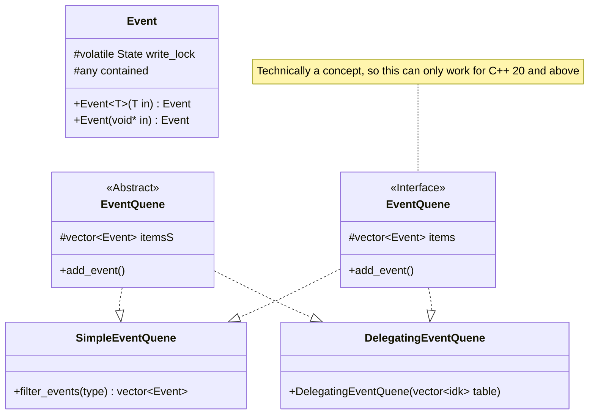
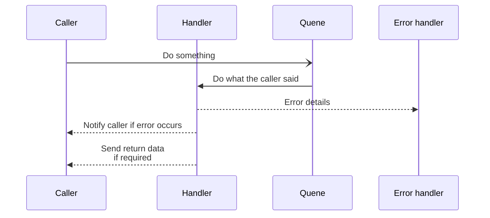
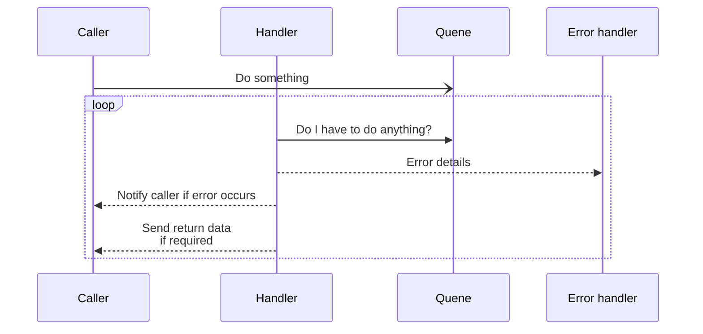

# Event system

## Event quenes

## Event handlers

### Calling

There are multiple different ways to call an event. The applicability of each
depends on the type of event and how it's triggered. For example, calling convention
B makes more sense for things like IO input events, because it isn't a problem if 
anything is unhandled. 

However, calling convention A makes more sense for events 
that have to be responded to, or for long running background processes like downloading
a file.

#### Calling convention A

In this option, the handler is instructed by the quene to handle an event sent
by the caller. The handler directly notifies the caller if it succeeds.

#### Calling convention B

In this option, the handler polls the quene to check if there's something it has
to respond to, and calls it. It directly notifies 
the caller if there's an error and also directly 
provides any return data

